# 音樂榜單追蹤 App 🎵

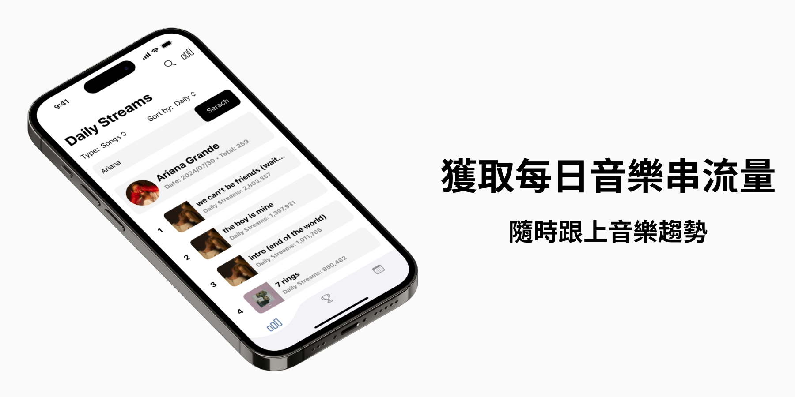

「音樂榜單追蹤應用程式」是一個可以讓使用者取得 Spotify 歌手專輯、歌曲每日串流量，並且還可以查看音樂的詳細資料。除此之外，使用者還可以查看特定歌手在 Billboard HOT 100 的排名歷史紀錄。

注意：此應用程式僅做為非營利、學習之用途。其中使用到的 Kworb.net 爬蟲 Spotify 串流量資料和 Billboard 榜單資料，皆僅限於學習和教育目的。學習的技術包括 Express 後端 API 伺服器架設、前端 API 串接、Node.js 爬蟲、陣列處理、JSON 解析和網路請求等。考量到著作權保護，後端程式碼將不會公開。

Note: This application is only for non-profit educational and learning purposes. The Kworb.net Spotify streaming data scraped and the Billboard HOT 100 data used in this application are strictly limited for learning and educational purposes. This project helps in learning various technologies such as setting up an Express backend API server, frontend API integration, web scraping with Node.js, array operations, JSON parsing, handling HTTP requests, etc. In consideration of copyright protection, the backend code will not be made public.

## App Demo 📱

### 串流量查詢


### 依據每日串流量或總串流量排序

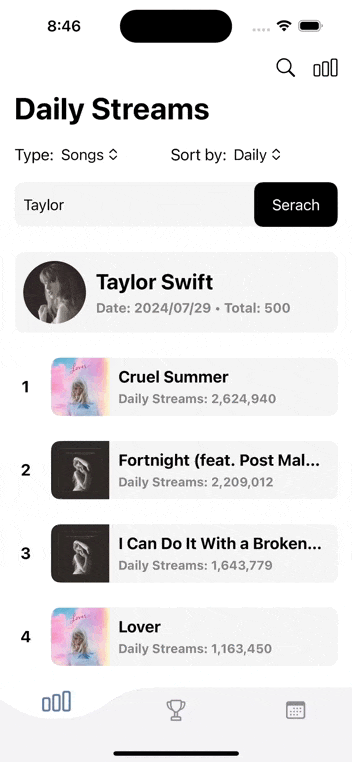

### 音樂詳情

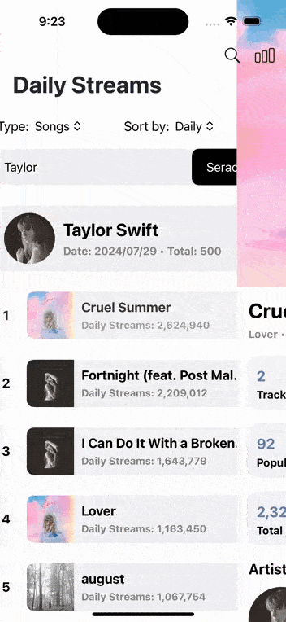

### 音樂篩選


### Billboard HOT 100 查詢

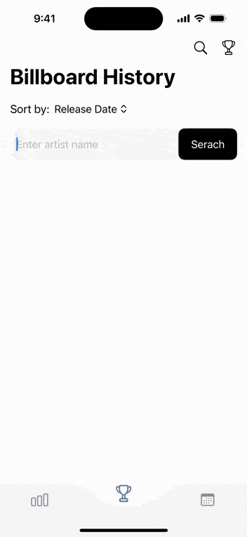

### Billboard 歌曲排序

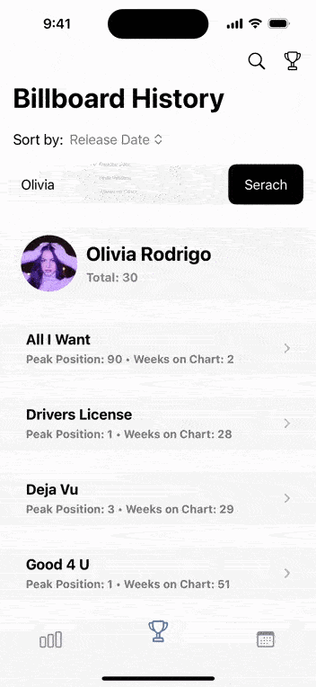

### Billboard 歌曲篩選


### Billboard 排名篩選

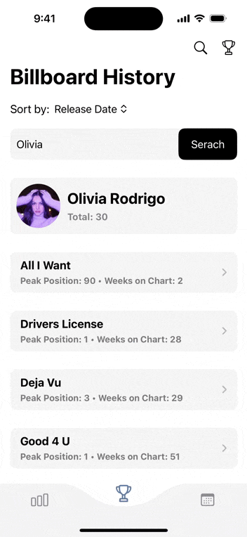

## 專案截圖與功能說明 📸

### 每日歌曲／專輯串流量與總串流量

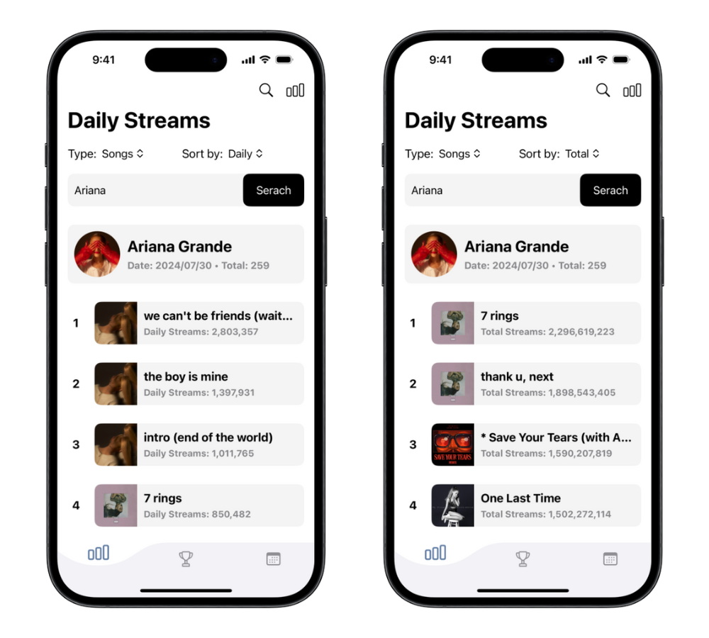

### 音樂詳情

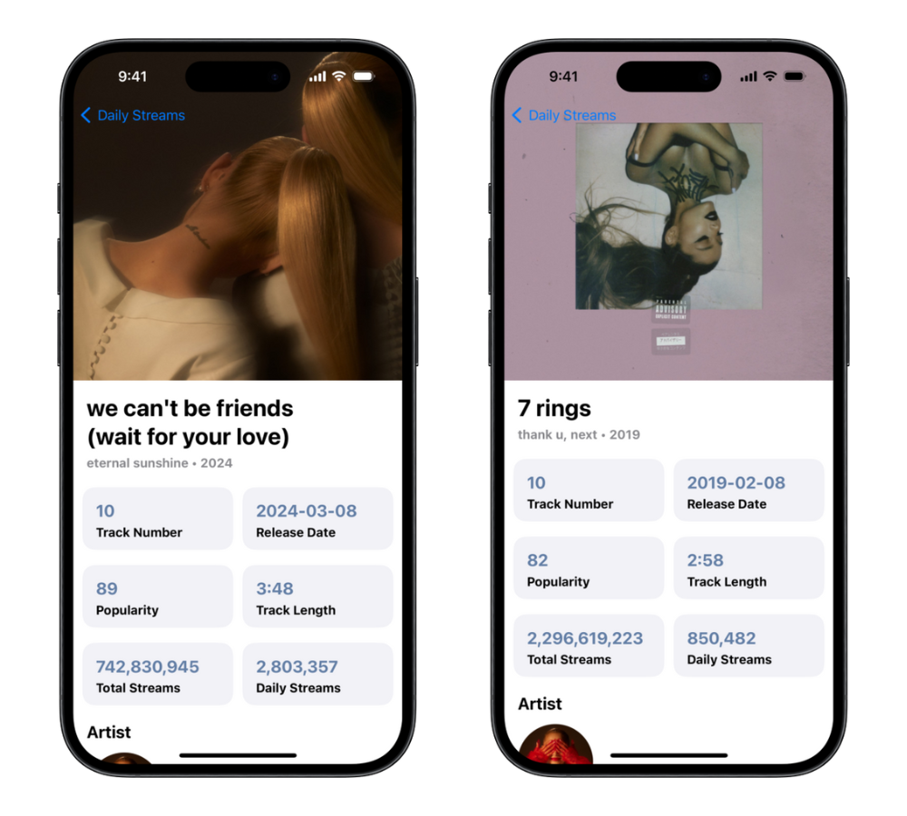

### 合作歌手（如果一首歌或專輯有多位歌手合作）

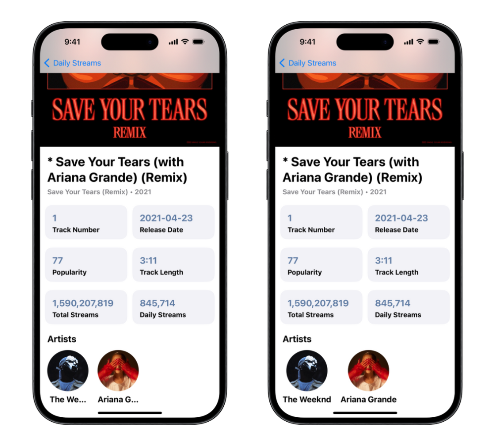

### 除歐美歌手，也可以查看華語歌手串流量

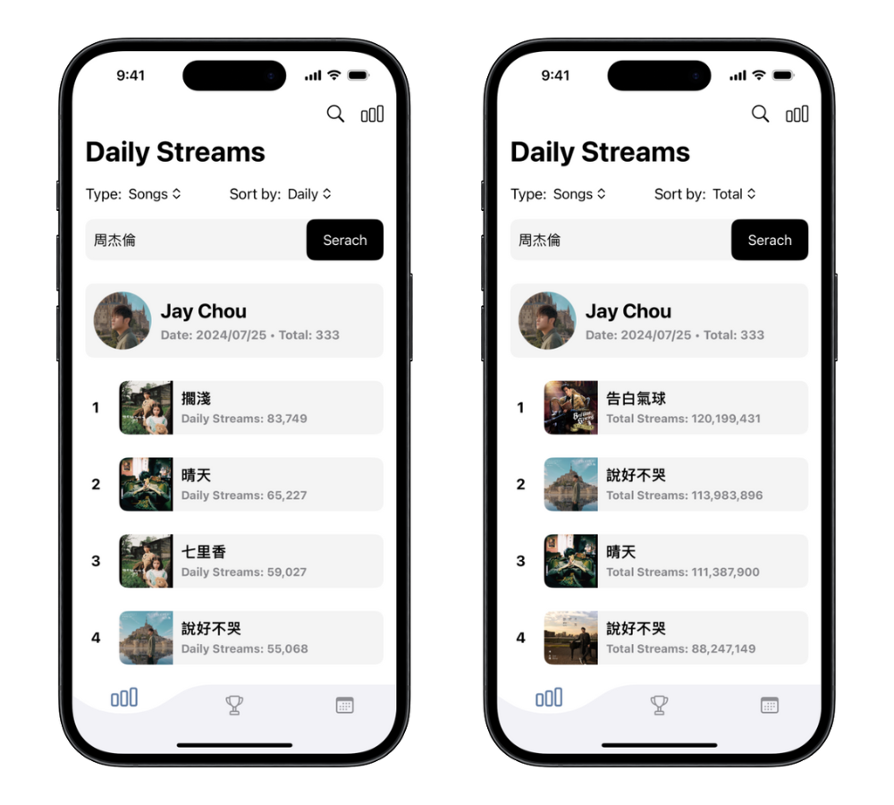
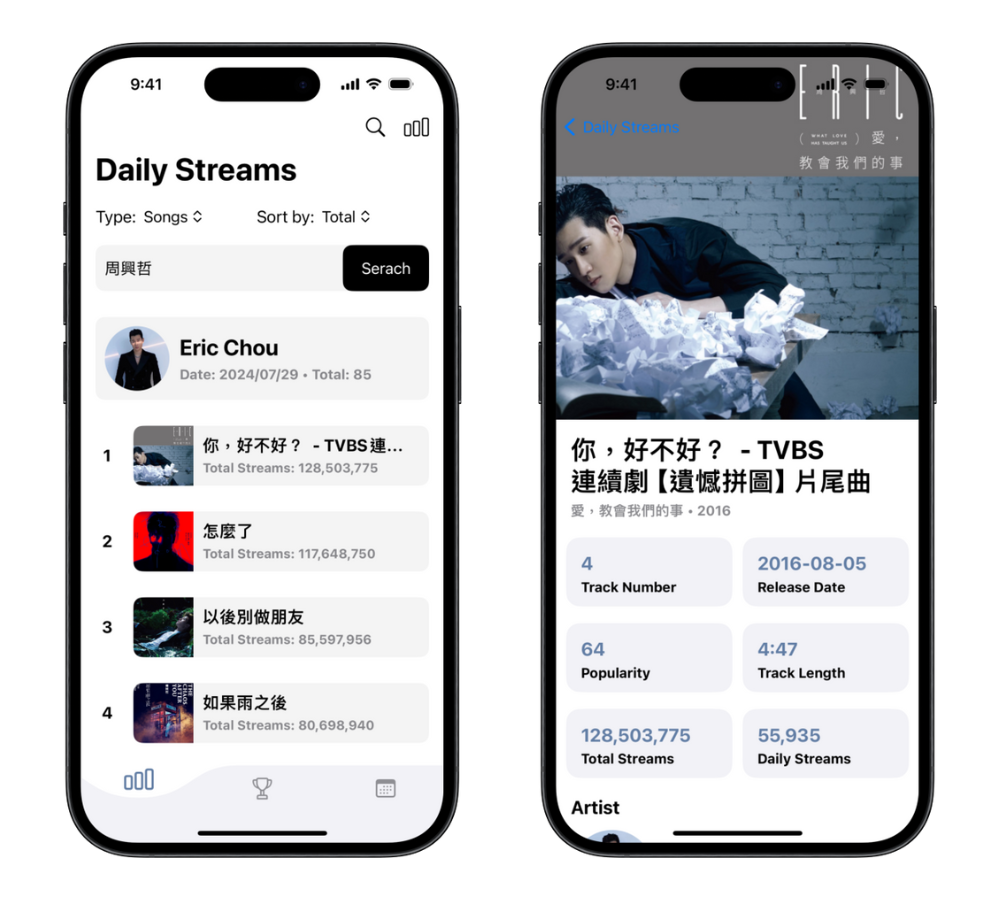

### Kpop 歌手串流量

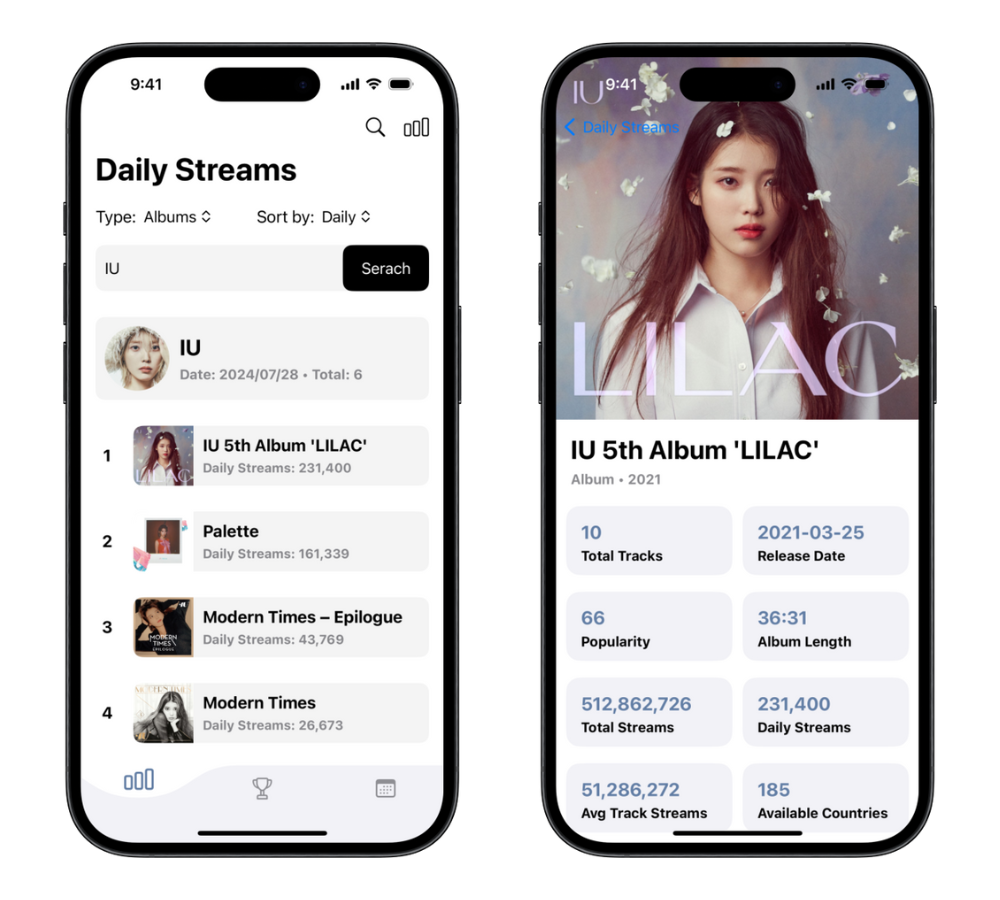

### 使用中文篩選歌曲

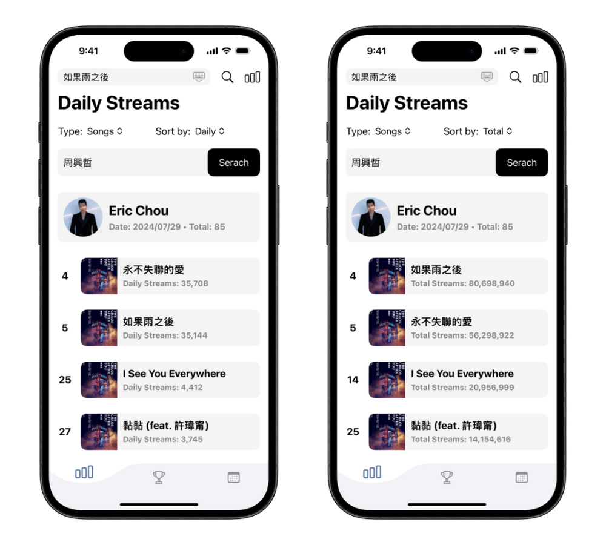

### Billboard HOT 100 特定歌手所有歷史排名與歌曲詳情

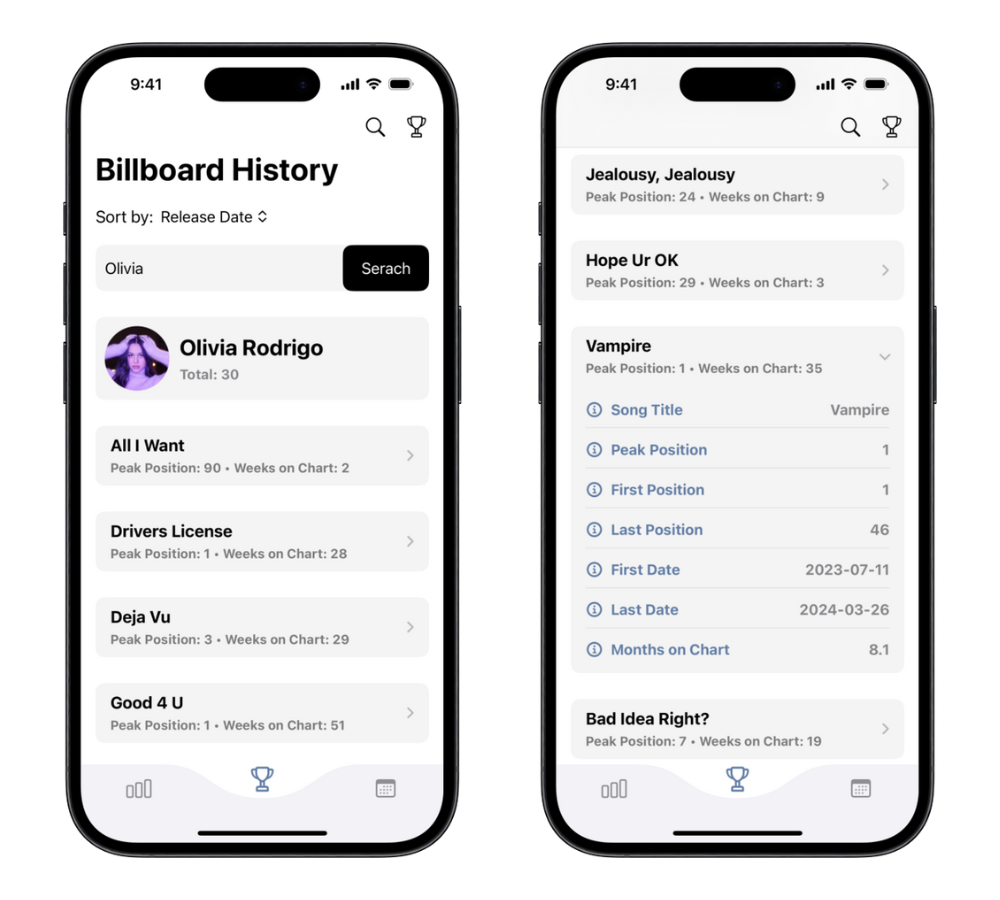

### 依據排名及在榜週數排序

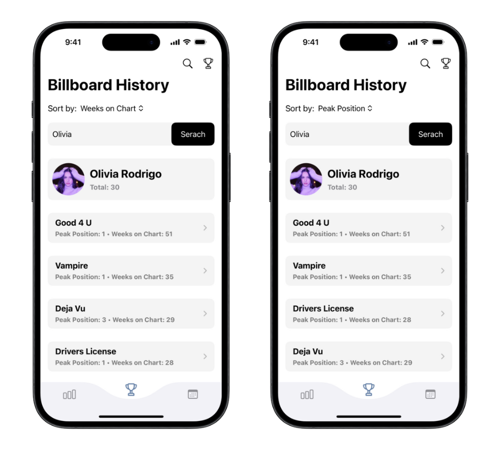

## 專案架構 🏗

### 使用技術與框架

- **前端**：Swift、SwiftUI、Almofire、SDWebImage/SDWebImageSwiftUI
- **後端**：Node.js、Express、axios、cheerio、SpotifyWebApiNode、Dotenv

### 串流量取得邏輯

1. 透過 `TextField` 取得使用者輸入的歌手名稱
2. 將歌手名稱向後端 API 伺服器發送 `HTTP GET` 請求
3. 使用 `SpotifyWebApi` 函式庫簡化 Spotify API 的串接，透過 `searchArtists()` 取得回傳陣列中第一個最相符的歌手資訊，並獲取歌手名稱、ID、圖片等，讓使用者不必輸入完整歌手名稱才能取得。如輸入 `Tay`，Spotify API 回傳的陣列第一個元素會是 `Taylor Swift`
4. 依據歌手 ID 與音樂類型至 Kworb.net 爬取歌手專輯或歌曲每日串流量，網址格式為： `https://kworb.net/spotify/artist/${artistId}_${type}.html`，以 Taylor Swift 為例： `https://kworb.net/spotify/artist/06HL4z0CvFAxyc27GXpf02_songs.html`
5. 使用 `cheerio` 套件解析 HTML，並針對可能為 NaN 的串流量做處理轉為 0。解析歌名或專輯名時，以名稱為 a 標籤的特性，進一步解析 a 標籤的 href 屬性，取得歌曲或專輯的 Spotify ID，並根據類型為歌曲或專輯取得封面等資訊，讓 App 畫面更豐富

> 特別注意：歌曲資料回傳的 Spotify URL 特意設計改為專輯的 URL，而非歌曲的 URL，目的是避免讓使用者點擊按鈕打開 Spotify 後會直接播放歌曲，切斷他們正在聽的音樂，影響使用者體驗。

#### 串流量回傳範例：

```json
{
  "artistInfo": {
    "name": "Taylor Swift",
    "image": "https://i.scdn.co/image/ab6761610000e5ebe672b5f553298dcdccb0e676"
  },
  "date": "2024/07/31",
  "streamData": [
    {
      "rank": 1,
      "musicName": "Cruel Summer",
      "albumName": "Lover",
      "albumType": null,
      "totalTracks": null,
      "trackNumber": 2,
      "duration": "2:58",
      "releaseDate": "2019-08-23",
      "imageUrl": "https://i.scdn.co/image/ab67616d0000b273e787cffec20aa2a396a61647",
      "totalStreams": 2335196365,
      "dailyStreams": 2953320,
      "popularity": 92,
      "availableMarkets": null,
      "spotifyUrl": "https://open.spotify.com/album/1NAmidJlEaVgA3MpcPFYGq",
      "musicId": "1BxfuPKGuaTgP7aM0Bbdwr",
      "isCollaboration": false
    },
    {
      "rank": 40,
      "musicName": "Fortnight (feat. Post Malone)",
      "albumName": "THE TORTURED POETS DEPARTMENT: THE ANTHOLOGY",
      "albumType": null,
      "totalTracks": null,
      "trackNumber": 1,
      "duration": "3:48",
      "releaseDate": "2024-04-19",
      "imageUrl": "https://i.scdn.co/image/ab67616d0000b2738ecc33f195df6aa257c39eaa",
      "totalStreams": 545126846,
      "dailyStreams": 2431027,
      "popularity": 82,
      "availableMarkets": null,
      "spotifyUrl": "https://open.spotify.com/album/5H7ixXZfsNMGbIE5OBSpcb",
      "musicId": "6dODwocEuGzHAavXqTbwHv",
      "isCollaboration": true
    }
  ]
}
```

### 合作歌手邏輯

1. 在獲取音樂資訊時依據 `track.artists.length > 1` 判斷是否有合作歌手
2. 若該音樂有合作歌手，在 App 中點進音樂詳情時，會向後端 API 伺服器發送請求，並判斷為歌曲或專輯，分別使用 `getTrack()` 或 `getAlbum()` 取得合作歌手的資訊

#### 合作歌手回傳範例：

```json
[
  {
    "name": "Jessie J",
    "image": "https://i.scdn.co/image/ab6761610000e5eb91f0dd753c09e051675a1ca6"
  },
  {
    "name": "Ariana Grande",
    "image": "https://i.scdn.co/image/ab6761610000e5eb40b5c07ab77b6b1a9075fdc0"
  },
  {
    "name": "Nicki Minaj",
    "image": "https://i.scdn.co/image/ab6761610000e5eb07a50f0a9a8f11e5a1102cbd"
  }
]
```

### Billboard HOT 100 排名取得邏輯

1. 利用 TextField 取得使用者輸入的歌手名稱，並透過 `HTTP GET` 請求傳送至後端 API 伺服器，串接 Spotify API 取得最匹配的歌手名稱
2. 使用 GitHub 上 [mhollingshead](https://github.com/mhollingshead) 整理的 [Billboard HOT 100 JSON 格式榜單資料](https://github.com/mhollingshead/billboard-hot-100) 作為資料來源，先透過 `axios` 取得資料，再透過 `filter()` 篩選出符合歌手名稱的歌曲
3. 由於一首歌可能會有多筆資料（上榜多個週數），因此使用兩個 `object` 分別存放 `firstWeekData` 與 `latestSongs`，`firstWeekData` 用於存放首週上榜的排名與日期，`latestSongs` 則透過 `weeks_on_chart` 週數最大者為歌曲最新資料特性，用於存放歌曲最近一次上榜的資料。使用物件原因為透過 `歌名 - 歌手名稱`，如 `22 (Taylor's Version) - Taylor Swift` 作為 `key`，能夠方便判斷一首歌是否在先前已經上榜過
4. 將 `firstWeekData` 與 `latestSongs` 的資料結合

#### 第 3 步程式碼

```javascript
// Use a dictionary to keep track of the latest record and first week data for each song
const latestSongs = {};
const firstWeekData = {};

// allSongs is an array of all songs by certain artist
allSongs.forEach((song) => {
  // Use song name and artist as a key to uniquely identify each song
  const key = `${song.song}-${song.artist}`;

  // Data for the first week on chart
  // If the song is not already in the dictionary or it's the first week on the chart, store the position and date as first week data
  if (!firstWeekData[key] || song.weeks_on_chart === 1) {
    firstWeekData[key] = {
      position: song.this_week,
      date: song.date,
    };
  }

  // Update the latest week's data
  // If the song is already in the dictionary, compare "weeks_on_chart" to keep the latest record
  if (latestSongs[key]) {
    if (song.weeks_on_chart > latestSongs[key].weeks_on_chart) {
      latestSongs[key] = song;
    }
  } else {
    // Add the song to the dictionary if it's not already there, means it's the only record
    latestSongs[key] = song;
  }
});
```

#### Billboard HOT 100 回傳範例

```json
{
  "artistInfo": {
    "name": "Olivia Rodrigo",
    "image": "https://i.scdn.co/image/ab6761610000e5ebe03a98785f3658f0b6461ec4"
  },
  "historyData": [
    {
      "song": "All I Want",
      "artist": "Olivia Rodrigo",
      "firstChartedPosition": 90,
      "firstChartedDate": "2020-01-14",
      "lastChartedPosition": 100,
      "lastChartedDate": "2020-01-21",
      "lastWeekPosition": 90,
      "peakPosition": 90,
      "weeksOnChart": 2
    },
    {
      "song": "Drivers License",
      "artist": "Olivia Rodrigo",
      "firstChartedPosition": 1,
      "firstChartedDate": "2021-01-19",
      "lastChartedPosition": 43,
      "lastChartedDate": "2021-07-27",
      "lastWeekPosition": 42,
      "peakPosition": 1,
      "weeksOnChart": 28
    }
  ]
}
```

## 未來功能與改進 ✨

- **日期搜尋**：在 App 中新增 `DatePicker`，並透過使用者選擇的日期作為參數傳給後端，後端使用 `find()` 取得特定日期資料。後端則使用 `find()` 函式來取得匹配該日期的排名資料，並將這些資料回傳給前端。

## 資料來源與版權聲明 📌

### Streaming Data

Spotify 串流資料來自 [Kworb.net](https://kworb.net)，該網站提供各大平台串流量的排行榜，包括 Spotify、iTunes、YouTube 等。音樂資料則來自 Spotify API，更多資訊請參考 [Spotify for Developers](https://developer.spotify.com/documentation/web-api)。

The Spotify streaming data comes from [Kworb.net](https://kworb.net), the website provides rankings and streaming data on various platforms, including Spotify, iTunes, YouTube, etc. The music data comes from the Spotify API, for more information please refer to [Spotify for Developers](https://developer.spotify.com/documentation/web-api).

### Billboard HOT 100

本項目使用的 Billboard HOT 100 資料由非官方來源整理，涵蓋從 1958 年到目前的每週排行榜數據。本資料僅用於個人學習和練習，無任何商業用途。本項目與任何官方機構或公司無關，僅為了展示和學習程式設計技能。資料由 Billboard 擁有，更多詳情請參考 [Penske Media Corporation](https://www.pmc.com/terms-of-use) 和 [Billboard](https://www.billboard.com/website-terms-of-use)。

The Billboard HOT 100 data used in this project is from unofficial sources, covering weekly chart data from 1958 to the present. This data is used for personal learning and practice only and has no commercial use. This project is not related to, nor affiliated with, any official organization or company and is only for the purpose of showcasing and learning programming skills. This data is owned by Billboard, see more details at [Penske Media Corporation](https://www.pmc.com/terms-of-use) and [Billboard](https://www.billboard.com/website-terms-of-use/).
